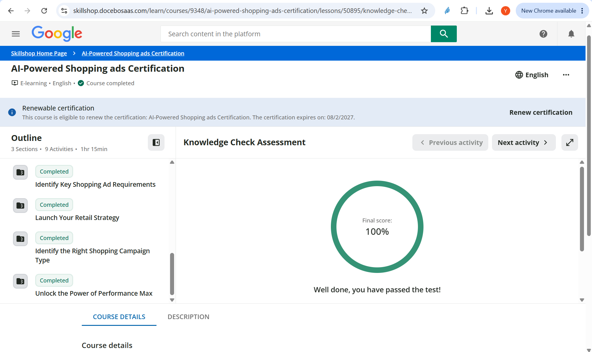

## Skillshop Module Completion

I completed the following assigned Google Skillshop modules:

- **Launch Your Retail Strategy**
- **Identify the Right Shopping Campaign Type**
- **Unlock the Power of Performance Max**

The screenshot below shows all three modules marked **Completed**. It also shows a **100%** score on the related Knowledge Check Assessment.

{fig-alt="Google Skillshop page showing Launch Your Retail Strategy, Identify the Right Shopping Campaign Type, and Unlock the Power of Performance Max marked completed, with a 100 percent knowledge check score." width=100%}

## CPP Farm Store Application Reflection

For CPP Farm Store, the most appropriate retail campaign objective would be to increase both online product discovery and in-store purchases. Because the store sells fresh produce, dairy products, pantry goods, seasonal items, and gift baskets, the campaign should focus on helping nearby customers learn what is available before they visit. A secondary objective could be to encourage online actions such as checking product availability, viewing store information, and planning a store visit. This creates an omnichannel strategy because the digital experience supports the physical farm store rather than replacing it.

The product categories that should receive the highest priority are seasonal produce, gift baskets, and frequently purchased refrigerated products. Seasonal produce is important because availability changes and customers may be especially interested in fresh, locally grown items. Gift baskets should also be promoted because they have a higher average order value and can be positioned for holidays, special occasions, and campus-related events. Dairy products such as milk, eggs, orange juice, and ice cream could support repeat visits because they are familiar products that customers purchase regularly. The campaign should avoid promoting too many products at once and instead organize products by category, season, margin, and customer demand.

A Performance Max approach appears most appropriate for CPP Farm Store because it can use Google AI to optimize toward sales or store-related goals across several Google channels. It can reach customers through Search, Shopping, YouTube, Display, Gmail, Maps, and other placements without requiring a separate campaign for every channel. However, the campaign should begin with a limited product selection, accurate Merchant Center data, clear conversion goals, and a controlled budget. Standard Shopping could also be useful later if the team needs more manual control over product groups, bidding, or reporting.

The campaign should support customer touchpoints including Google Search, the Shopping tab, Google Images, Google Maps, the Shopify storefront, and the physical store. Customers should be able to move easily from discovering a product online to checking its price, availability, store hours, and pickup information. Consistent product titles, images, prices, and policies would reduce friction and strengthen customer trust.

CPP Farm Store should track impressions, clicks, click-through rate, cost per click, conversions, conversion value, return on ad spend, product-level performance, store visits, and online-to-store actions. The team should also monitor which categories generate the strongest engagement and whether seasonal campaigns improve traffic and sales.

Our group can apply these lessons directly to the Campaign Plan, Creative Brief, and Dashboard. The Campaign Plan can define objectives, audiences, channels, product priorities, budget, and bidding strategy. The Creative Brief can guide product images, promotional messages, and calls to action. The Dashboard can report campaign KPIs by channel, product category, and customer action so the team can evaluate performance and recommend improvements.

## Appendix

- **GitHub Pages:** [View Published Report](https://erttbx.github.io/week8/)
- **GitHub Repository:** [View GitHub Repository](https://github.com/erttbx/week8)
